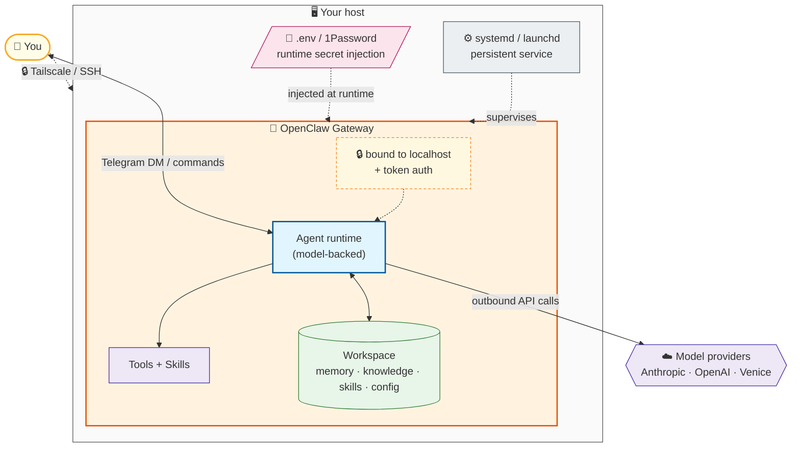

# OpenClaw + Telegram bootstrap (boilerplate)

This is a **starting point** for bringing a fresh host online with an OpenClaw agent similar to Sean's setup — a VPS, a Raspberry Pi, a home server, a cloud VM, or your own Linux/Mac box.

It goes a bit **beyond** the default OpenClaw onboarding by:

- explaining **why** you need specific keys (Brave, OpenAI, etc.)
- showing how to wire **memory + search** so the agent isn’t “half‑blind”
- documenting the **Telegram group permission syntax** so you can safely add more people/groups
- including an optional helper for **Venice Diem** balance/rate limits.

> 🔒 **Before you start:** skim [security-hardening.md](security-hardening.md) and decide your trust boundaries first (loopback bind, user allowlists, secrets in `.env`, firewall). Security is part of getting running, not a bolt-on.

---

## Prerequisites

Have these ready before you start — it makes the rest of the walkthrough smooth.

**Host**

- A Linux host you control (VPS, Raspberry Pi, home server, cloud VM) or your own Linux/Mac box. A recent Ubuntu LTS / Debian-ish system is assumed below; **🍎 macOS deltas are called out inline** where the steps differ (Node install, the persistent service, the firewall).
- Rough sizing: **2 GB RAM minimum**, 4–8 GB comfortable (memory + local embeddings + a headless browser get hungry); ~2 cores; 20+ GB disk.
- SSH access — and ideally [Tailscale](tailscale-setup.md) for safe remote reach (optional but recommended).

**Accounts & keys** (grab the ones you need)

- **Telegram bot token** — from [@BotFather](https://t.me/BotFather). *Required* for the Telegram path.
- **A model provider with working auth** — OpenAI (Codex OAuth), Anthropic, and/or Venice. *Required* — this is the agent's brain.
- **Brave Search API key** — *recommended*; without a search provider the agent is half-blind ([why](#why-the-brave-api-key-matters)).
- **1Password** — optional but recommended, to keep secrets out of config; see [1password-runtime-secrets.md](1password-runtime-secrets.md).

**Tooling** (installed during setup)

- Node.js 22.x + `npm` (§1), then OpenClaw itself (§2).
- Some *augments* need extras — e.g. Ollama + Python for [local embeddings](../augments/memory/local-embeddings-guide.md) / [knowledge-search](../augments/skills/knowledge-search.md). Not needed for the core path.

> First time? You only strictly need a **host + Telegram bot token + one model provider** to get a talking agent. Everything else is additive.

---

## Architecture — the shape of what you're building

Before the steps, here's what you're standing up. One OpenClaw **Gateway** runs on your host — bound to localhost behind token auth — and you reach the **agent** through Telegram, while reaching the **box itself** privately over Tailscale/SSH. The agent works against your **workspace** (memory, knowledge, skills, config) and **tools**, calls out to your **model provider(s)**, pulls **secrets** from `.env`/1Password at runtime, and is kept alive by the OS service manager (**systemd** on Linux, **launchd** on macOS).



> This is the **core** shape. Everything in [augments/](../augments/) — extra channels, a second doctor/sandbox gateway, local embeddings — hangs off this same single gateway.

---

## 1. System + Node

- Use a recent Ubuntu LTS.
- Install Node.js 22.x (via NodeSource or nvm).

```bash
# example (NodeSource):
curl -fsSL https://deb.nodesource.com/setup_22.x | sudo -E bash -
sudo apt-get install -y nodejs
```

> 🍎 **macOS:** skip the apt / NodeSource lines — install Node with Homebrew (`brew install node@22`) or nvm. Everything from §2 on is identical.

## 2. Install OpenClaw globally

```bash
npm install -g openclaw
openclaw --version
```

## 3. Prepare workspace

```bash
mkdir -p ~/.openclaw/workspace
cd ~/.openclaw/workspace
```

Recommended top-level files in the workspace (mirroring Sean/JPop's pattern):

- `AGENTS.md` – notes about how the agent behaves.
- `SOUL.md` – persona / tone.
- `USER.md` – who you are.
- `MEMORY.md` + `memory/YYYY-MM-DD.md` – long-term + daily notes.

---

## 4. Configure OpenClaw (config template)

Copy the template into place:

```bash
mkdir -p ~/.openclaw
cp setup/config/openclaw.template.json ~/.openclaw/openclaw.json
```

Then edit `~/.openclaw/openclaw.json` and fill in:

- `plugins.entries.brave.config.webSearch.apiKey` → your **Brave Search API key** (and keep `tools.web.search.provider: "brave"`).
- `channels.telegram.botToken` → your **Telegram bot token** from **@BotFather**.
- `channels.telegram.groups` → your group IDs and enable flags.
- `gateway.auth.token` → any random secret string for local API auth.

### Why the Brave API key matters

Web search runs through a **provider**. This template selects Brave via `tools.web.search.provider: "brave"` and stores the key under the brave plugin at `plugins.entries.brave.config.webSearch.apiKey`.

- Without a configured provider/key, `/web_search` will be effectively disabled, and the agent will say it can’t search.
- With it, the agent can:
  - look up live data (markets, docs, news)
  - fetch external docs when answering questions

This repo defaults to **Brave Search**, but Brave is just one of several providers OpenClaw supports (Tavily, Exa, DuckDuckGo, Perplexity, Grok); switch `tools.web.search.provider` and the matching plugin entry to use another.

> Note: the legacy `tools.web.search.apiKey` path still loads through a compatibility shim, but `plugins.entries.brave.config.webSearch.apiKey` is the canonical location today.

### Why the OpenAI (and other model) keys matter for memory

The **memory system relies on models that can call `memory_search` and read/write files**. In a typical setup:

- The **primary chat model** (here `openai/gpt-5.5`) is what you talk to.
- Sub‑agents (cron jobs, background tasks) often use a cheaper model (e.g. Haiku) to:
  - scan `memory/*.md`
  - update `MEMORY.md`
  - keep long‑term notes consistent.

Make sure you have working auth for:

- `openai` (for GPT‑5.5 / 5.4‑mini style models — Codex OAuth is selected via the bundled `codex` plugin, enabled in the template)
- `anthropic` (for Haiku/Sonnet/Opus, if you use them)
- `venice` (for Kimi/DeepSeek, if configured)

If those providers are not properly configured, things like **`memory_search` will silently fail** or be much less useful (the agent can’t “remember” across days).

The template assumes you’ll provide credentials via the normal OpenClaw auth mechanisms (token, OAuth, etc.), not hardcoded into `openclaw.json`.

---

## 5. Telegram wiring + permissions

1. Create a bot with **@BotFather**.
2. Add the bot to your group.
3. Optionally disable **privacy mode** in BotFather if you want it to see all messages.
4. Put the group id(s) + bot token into `openclaw.json`.

### `channels.telegram.groups` structure

Example snippet:

```json
"channels": {
  "telegram": {
    "enabled": true,
    "dmPolicy": "pairing",
    "botToken": "YOUR_TELEGRAM_BOT_TOKEN_HERE",
    "groups": {
      "-1001234567890": {
        "requireMention": false,
        "enabled": true
      },
      "-1009876543210": {
        "requireMention": true,
        "enabled": true
      }
    },
    "groupAllowFrom": [
      1111111111,
      2222222222
    ],
    "groupPolicy": "allowlist",
    "streamMode": "partial"
  }
}
```

**Fields:**

- `groups[GROUP_ID].enabled` – controls whether the bot is active in that group at all.
- `groups[GROUP_ID].requireMention` – if `true`, the agent only responds when @mentioned.
- `groupPolicy`: usually `"allowlist"` so only IDs in `groupAllowFrom` can control the bot.
- `groupAllowFrom`: array of Telegram **user IDs** that are allowed to issue commands / direct the agent in groups.

**How to permission a new person:**

1. Get their Telegram **numeric user ID** (via a “user info” bot or logging).
2. Add it to `groupAllowFrom`:

   ```json
   "groupAllowFrom": [
     1111111111,  // owner
     2222222222,  // friend
     3333333333   // new person
   ]
   ```
3. Restart the gateway (or reload config) so the change takes effect.

This makes it explicit **who** the agent will treat as an authority inside group chats.

---

## 6. Optional: Venice Diem balance helper

If you use **Venice** as a model provider and want a quick way to check your Diem balance and rate limits, the [`diem-balance` skill guide](../augments/skills/diem-balance.md) walks you through building a small helper script:

- `~/.openclaw/workspace/skills/diem-balance/diem.py` (you create this by following the guide)

> For usage + cost reporting across **all** providers (not just Venice Diem), see nicknmorty's [OpenClaw Usage Meter](https://github.com/nicknmorty/openclaw-usage-meter).

It:

- reads your Venice API key from `~/.openclaw/agents/main/agent/auth-profiles.json` (the standard OpenClaw auth location),
- sends a tiny test request to Venice,
- prints:
  - HTTP status,
  - any error message, and
  - all relevant `x-venice-balance-*` and `x-ratelimit-*` headers.

Usage:

```bash
python3 ~/.openclaw/workspace/skills/diem-balance/diem.py
```

You should see something like:

```text
HTTP status: 200
Venice headers (balance / rate limits):
- x-venice-balance-diem: 1.69...
- x-ratelimit-limit-requests: ...
- x-ratelimit-remaining-requests: ...
...
```

If your Diem balance is depleted, you may see HTTP 402 errors or missing balance headers.

---

## 7. Start the gateway

```bash
openclaw gateway start
openclaw status
```

> **`gateway.mode` must be set.** The gateway refuses to start unless `gateway.mode` is configured (this template sets `gateway.mode: "local"`). If you hand-build a config and omit it, the gateway will fail to start with a non-obvious error.

> **CLI verbs:** `openclaw gateway start` runs the gateway in the foreground (handy for first-run testing); `openclaw gateway restart` reloads an already-running gateway after a config change; the systemd units in `setup/infra/systemd/*` use `openclaw gateway run --port …` to run it as a managed background service. All are valid — pick `start` while testing and the systemd-managed `run` for a persistent install.

> 🍎 **macOS:** the `setup/infra/systemd/*` units are Linux-only. On macOS, run **`openclaw gateway install`** — it sets up a launchd **LaunchAgent** automatically, then `openclaw gateway start / stop / restart / status` manage it. (`gateway install` is per-OS: launchd on macOS, systemd on Linux, schtasks on Windows.)

Once the gateway is running and Telegram is configured, messages in your group should start hitting the agent.

---

## 8. Verify it works, and troubleshooting

Once the gateway is up: confirm it's actually live (`openclaw status`, DM your bot, test web search + memory), and reach for **`openclaw doctor`** / `openclaw doctor --fix` when something's off. The full verify checklist + common-gotchas table live in **[troubleshooting/](../troubleshooting/README.md)**.

---

This repo is intentionally a *setup assistant*, not a framework — adjust the template + docs to taste and commit your own defaults.